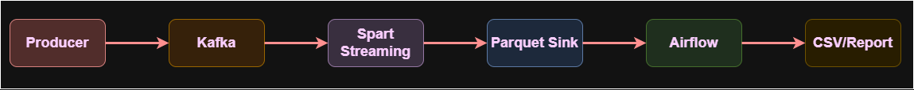

# FinTech Real-Time Fraud Detection Pipeline

## 1. Introduction & Scenario Overview

In the rapidly evolving FinTech landscape, real-time fraud detection is a critical requirement for maintaining consumer trust and financial stability. This project implements an end-to-end data pipeline designed to detect fraudulent transactions—specifically high-value anomalies and "impossible travel" scenarios—as they occur, while simultaneously providing robust batch-based reconciliation for financial auditing.

---

## 2. Technical Stack Justification

| Component | Technology | Justification |
|---|---|---|
| Ingestion | Apache Kafka | Kafka serves as the high-throughput distributed backbone. In a FinTech environment, the system cannot afford to lose a single transaction record if a downstream consumer fails. Kafka provides the necessary durability and decoupling, allowing producers to send data at high velocity without overwhelming the processing engine.  |
| Stream Processing | Apache Spark | Chosen for its Stateful Processing capabilities. Unlike simple filters, Spark can remember user state across micro-batches to detect "Impossible Travel" patterns and makes it ideal for complex fraud logic. |
| Orchestration | Apache Airflow | While Spark handles the "Speed Layer," Airflow manages the "Batch Layer." Financial systems require periodic "source of truth" reports. Airflow orchestrates the movement of validated data into long-term storage and generates reconciliation reports every 6 hours, ensuring the books balance and providing human-readable insights.  |
| Storage / Sink | Parquet Files | A columnar format that provides extreme compression and high-speed analytical performance for the reporting layer. Since our reports primarily aggregate the Amount column, Parquet allows the system to skip irrelevant metadata during the read process, significantly reducing I/O.  |
 
---

## 3. System Architecture (Lambda Architecture)

The system follows a **Lambda Architecture**, combining a **Speed Layer** for immediate detection and a **Batch Layer** for comprehensive auditing and reporting.

```text
Source → Kafka → Spark Streaming → Parquet Storage → Airflow Reporting
```


---

## 4. Event Time vs. Processing Time Handling

In financial systems, **Processing Time** (when the server receives data) can be misleading due to network latency. This project prioritizes **Event Time** (when the transaction actually occurred).

### Watermarking
A **10-minute watermark** is implemented to handle out-of-order data.

### Logic
Spark holds the state of a user's location for 10 minutes. If a transaction is delayed due to poor connectivity, it is still accurately processed against the **Impossible Travel** rule.

### Mathematical Threshold

```text
Threshold = max(eventTime) - 10 minutes
```

---

## 5. Analytic Report: Fraud by Merchant Category

The pipeline automatically categorizes fraud attempts to identify high-risk sectors.

### Raw Data Output

> **[INSERT SCREENSHOT OF fraud_by_category.csv HERE]**

### Categorization Analysis

| Merchant Category | Fraud Count | Risk Profile |
|---|---|---|
| Travel | 5 | High (Identity Theft / Impossible Travel) |
| Luxury | 1 | Moderate (High Value Anomalies) |
| Food | 3 | Low (Credential Stuffing / Small Tests) |
| Electronics | 1 | Moderate (High Resale Value) |

### Key Insight

The highest fraud frequency occurred in **Travel**. This aligns with the detection algorithm, as fraudsters often target travel bookings for high-value liquidations that are difficult to reverse.

---

## 6. Ethics, Privacy & Data Governance

### Privacy Implications

Detecting fraud requires tracking user location and spending habits. This constitutes **User Profiling**, which carries risks of surveillance. If leaked, a user’s physical movements and financial status would be exposed.

### Data Governance Strategy

#### Anonymization
User IDs should be hashed (e.g., salted SHA-256) so the engine detects patterns without knowing user's real-world identities.

#### Data Minimization
Only city-level location data is stored, rather than precise GPS coordinates.

#### Retention Policy
In compliance with GDPR, transaction logs are moved to a "Warehouse" with a 7-year purge policy for financial auditing compliance.

---

## 7. Project Final Reconciliation

The following report confirms that the **Speed Layer** and **Batch Layer** are synchronized.

> **[INSERT SCREENSHOT OF reconciliation.csv HERE]**

### Validation Formula

```text
Total Ingress == Validated Amount + Fraud Amount
```

### Current Run Status

✅ Successfully Balanced

---

# 🚀 How to Run

## 1. Initialize Stack

```bash
docker-compose up -d
```

## 2. Start Stream Processing

```bash
docker exec -it spark /opt/spark/bin/spark-submit --packages org.apache.spark:spark-sql-kafka-0-10_2.12:3.5.1 /opt/spark-apps/fraud_detection.py
```

## 3. Generate Transaction Data

```bash
python producer/transaction_producer.py
```

## 4. Run Airflow Orchestration

Access Airflow at:

```text
http://localhost:8080
```

Then trigger:

```text
reconciliation_dag
```

## 8. Conclusion
The implemented Lambda architecture successfully bridges the gap between real-time
responsiveness and historical accuracy. By leveraging Kafka, Spark, and Airflow, the system
provides a resilient framework for FinTech security, ensuring that fraud is not only caught in
milliseconds but also documented for long-term financial integrity. 


